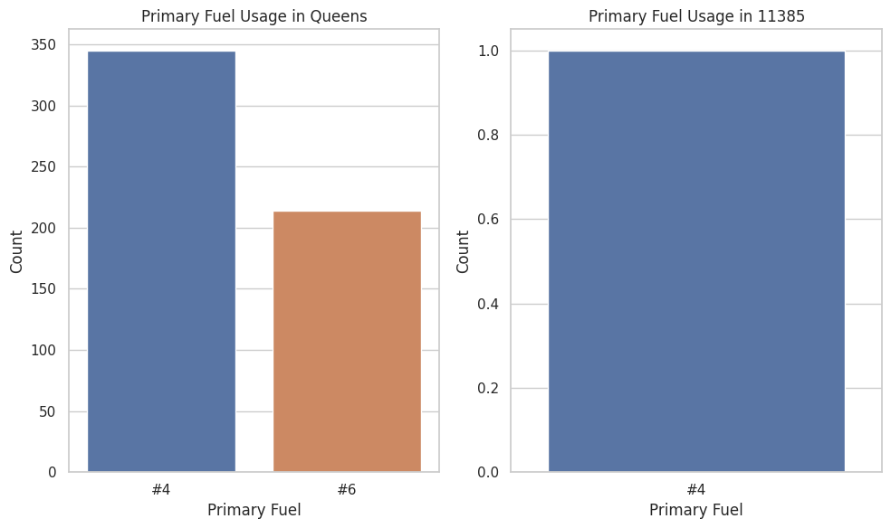
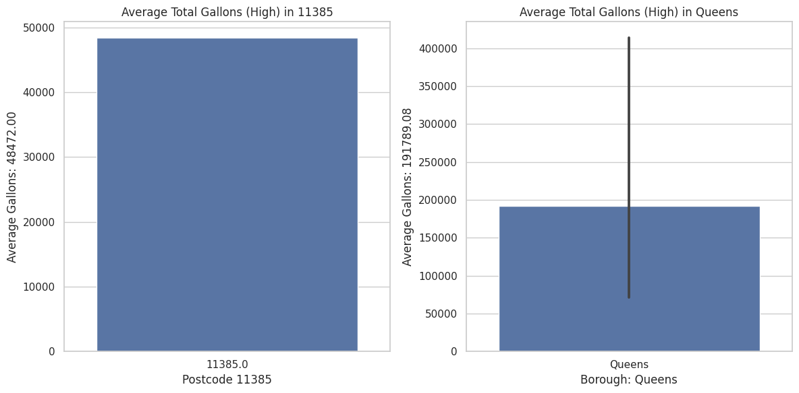

# HC1
This is the neighborhood of Ridgewood.

Zip code 11385 is a lively and diverse community with energetic streets and a variety of people. The area has a lot of people packed into each square mile. Many different kinds of people live there. The average age in this area is 36.2 It has a good mix of young professionals and people who have lived here for a long time, which makes it vibrant and exciting. This area has people of all ages, including many different generations. About 1 in 5 people are under 18 years old, showing that there are a lot of young people. Around 27.46% of people aged between 18 and 34 years old are considered young adults. The group of people who are 35 to 64 years old is the biggest, representing 40. 92% of the population. In zip code 11385, there are older people, aged 65 and over, who make up a smaller but important part of the community. They represent 11. 4% of the total residents and contribute to the diversity and mix of different generations in the area.

# HC 11

# HC 11

# HC6

In the vibrant heart of the city that never sleeps, where skyscrapers light up the night sky, a quiet revolution is happening—a change that might not steal the spotlight but is breathing life into the air we all share. Imagine New York City not just as a dazzling metropolis but as a place committed to a cleaner, greener future. At the forefront of this movement is the NYC Clean Heat Program, a lifeline for residents amidst the hustle and bustle, offering more than just a breath of fresh air.

Beyond the glitz of the city, there's a collective effort to embrace cleaner heating fuels, bringing down air pollution and energy costs. The program doesn't just preach change; it provides the means for it, extending a helping hand to homes and buildings, turning them into champions of sustainability. The partnership with the NYC Retrofit Accelerator is like a tag-team for energy efficiency, making every building a fortress against waste. And guess what? It's working! The city, once shrouded in pollution, now breathes the cleanest air it has in fifty years. In a world grappling with climate change, this program is not just a program—it's a symbol of hope, a roadmap for cities globally, and proof that when we all pitch in, we can tackle environmental challenges head-on. The lights that make the New York skyline a spectacle aren't just for show—they're a symbol of a cleaner, brighter, and more sustainable future.

So, how do we make this happen everywhere? It starts with all of us. We need to spread the word, make sure everyone understands how our choices impact the environment. And to make going green easier, let's throw in some incentives and subsidies, making sustainability a no-brainer for everyone. Partnerships like the one between the NYC Clean Heat Program and the NYC Retrofit Accelerator show us the power of working together. Every city can take a page from New York's book, tailoring similar programs to fit their own vibe. And let's keep the innovation flowing—research and development into cool, sustainable technologies will keep the city on the cutting edge of clean energy. By joining forces and taking care of our shared home, we can ensure that the lights of our cities not only dazzle but also stand as symbols of our commitment to a planet that thrives alongside our urban adventures.

# HC11

